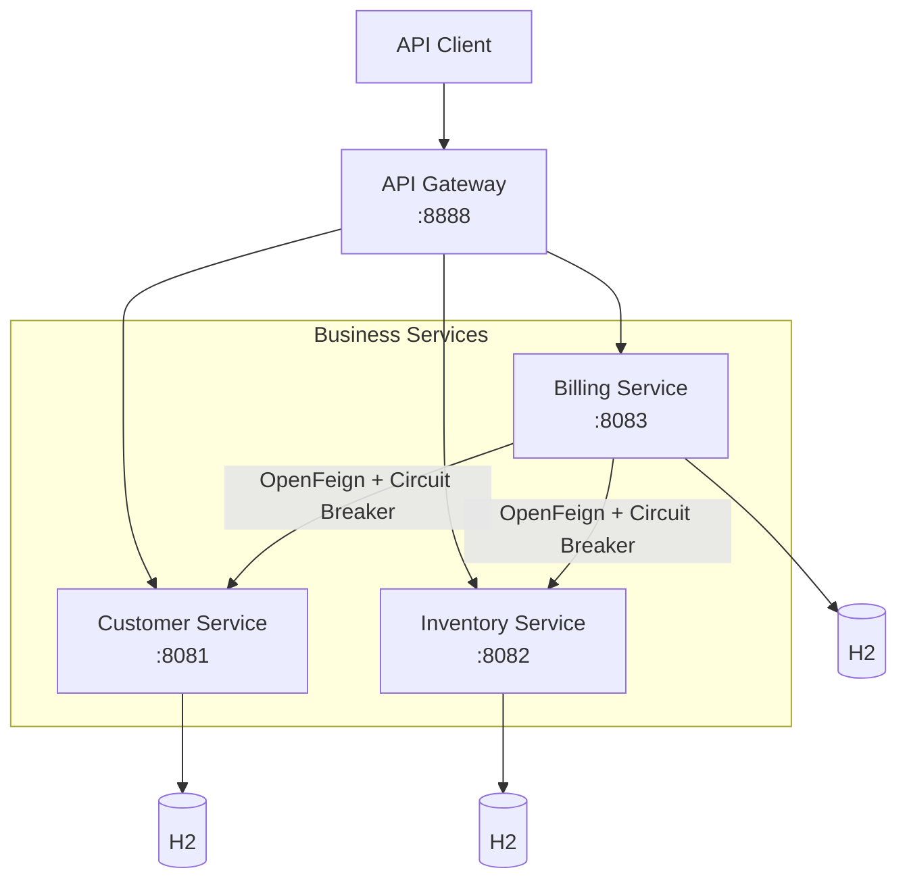
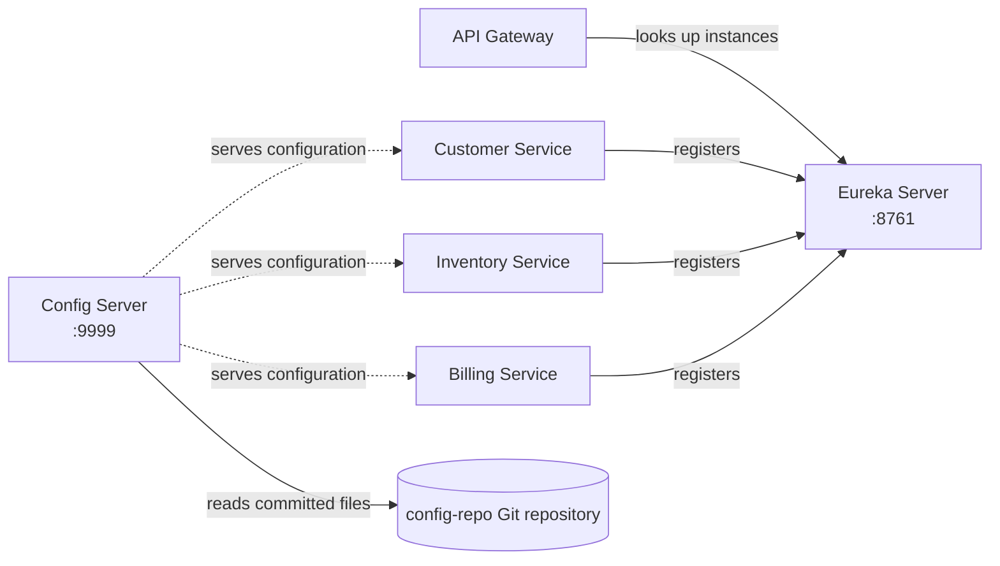

# E-Commerce Microservices

A learning project that models a small e-commerce backend with Spring Boot microservices. It demonstrates service discovery, API gateway routing, centralized configuration, layered REST APIs, and resilient service-to-service calls.

> **Built with:** Java 21 · Spring Boot 4 · Spring Cloud · Maven

## Architecture

### Request flow



### Service discovery and configuration



Each business service follows a familiar layered structure:

`REST Controller → Service → Repository → H2 database`

DTOs and MapStruct mappers separate API payloads from persistence entities. Centralized exception handlers return consistent error responses.

## Services

| Module | Port | Responsibility |
| --- | ---: | --- |
| `dicovery-service` | 8761 | Eureka registry for service registration and discovery. The module name is spelled this way in the repository. |
| `config-service` | 9999 | Spring Cloud Config Server backed by the local Git repository in `config-repo/`. |
| `gateway-service` | 8888 | Spring Cloud Gateway; discovers services through Eureka and creates routes from service IDs. |
| `customer-service` | 8081 | Customer REST API, DTO mapping, business logic, and H2 persistence. |
| `inventory-service` | 8082 | Product and stock REST API with H2 persistence. |
| `billing-service` | 8083 | Bill and bill-item API; enriches bills with customer and product data through OpenFeign. |

## What the project demonstrates

- **Microservice boundaries:** customer, inventory, and billing run as separate Spring Boot applications.
- **MVC and service layers:** controllers handle HTTP requests, services contain business operations, and repositories handle persistence.
- **DTO mapping:** MapStruct maps between API DTOs and JPA entities.
- **Service discovery:** Eureka lets services find one another by service ID rather than fixed instance addresses.
- **API gateway:** Gateway routes requests to registered services, with lower-case service IDs enabled.
- **Centralized configuration:** Config Server reads service configuration from the Git-backed `config-repo/` directory.
- **Resilient remote calls:** Billing uses OpenFeign with Resilience4j Circuit Breakers and fallback responses for customer and product lookups.
- **Operational endpoints:** Actuator exposes health and refresh endpoints where configured.
- **Demo data:** Customer, inventory, and billing services initialize sample data at startup. H2 databases are in-memory, so data resets when a service restarts.

## API examples

The direct service URLs are shown below. The gateway uses the same paths prefixed by the lower-case service ID.

| Operation | Direct URL | Through gateway |
| --- | --- | --- |
| List customers | `http://localhost:8081/customers` | `http://localhost:8888/customer-service/customers` |
| Get customer | `http://localhost:8081/customers/1` | `http://localhost:8888/customer-service/customers/1` |
| Read configured customer parameter | `http://localhost:8081/customers/params` | `http://localhost:8888/customer-service/customers/params` |
| List inventory products | `http://localhost:8082/inventories` | `http://localhost:8888/inventory-service/inventories` |
| Get inventory product | `http://localhost:8082/inventories/1` | `http://localhost:8888/inventory-service/inventories/1` |
| Get a bill with related data | `http://localhost:8083/bills/1` | `http://localhost:8888/billing-service/bills/1` |

Customer and inventory controllers also provide `POST` and `PUT` operations. A `DELETE` mapping is present, but its current path needs correction before use. Billing currently exposes bill retrieval by ID.

### Circuit Breaker behavior

Billing calls customer and inventory services using OpenFeign. When a call fails, the configured Resilience4j fallback returns a cached placeholder object, allowing the bill request to complete. The fallback is intended for resilience demonstrations; it is not a persistent cache.

The inventory controller currently serves products under `/inventories/{id}`. For live product enrichment in billing, its Feign client path must match that route; otherwise the Circuit Breaker fallback is used.

## Technology stack

- Java 21
- Spring Boot 4.0.8
- Spring Cloud 2025.1.3
- Spring MVC and Spring Data JPA
- Spring Cloud Netflix Eureka Client and Server
- Spring Cloud Gateway
- Spring Cloud Config Server and Config Client
- Spring Cloud OpenFeign
- Resilience4j Circuit Breaker
- H2 in-memory database
- MapStruct and Lombok
- Spring Boot Actuator
- Springdoc OpenAPI UI in the billing service
- Maven

## Run locally

### Prerequisites

- JDK 21
- Maven
- Git

### Prepare the Config Server

The Config Server is configured in `config-service/src/main/resources/application.yaml` to read `config-repo/` from a local filesystem path. Update `spring.cloud.config.server.git.uri` to the absolute path of `config-repo/` on your computer.

The Config Server's Git backend reads committed configuration. Commit the configuration files inside `config-repo/` before expecting the server to serve their latest contents.

### Start the applications

Run each command in a separate terminal from the project root, in this order:

```bash
mvn -f dicovery-service/pom.xml spring-boot:run
mvn -f config-service/pom.xml spring-boot:run
mvn -f customer-service/pom.xml spring-boot:run
mvn -f inventory-service/pom.xml spring-boot:run
mvn -f billing-service/pom.xml spring-boot:run
mvn -f gateway-service/pom.xml spring-boot:run
```

Start Eureka and Config Server before the business services. Inventory imports Config Server configuration as required; customer and billing use an optional Config Server import in their local settings.

After startup, open the Eureka dashboard at `http://localhost:8761` and send API requests through `http://localhost:8888`.

## Configuration and operations

Service-specific configuration is stored in `config-repo/`, for example `customer-service.yaml`, `inventory-service.yaml`, and `billing-service.yaml`. The Config Server environment endpoint for a service follows this pattern:

```text
http://localhost:9999/{service-name}/default
```

For example: `http://localhost:9999/inventory-service/default`.

The services expose Actuator health and refresh endpoints where enabled. Refresh a particular service directly, for example:

```http
POST http://localhost:8081/actuator/refresh
```

The customer service is configured with `eureka.client.refresh.enable: false` so a configuration refresh does not recreate its Eureka client.

## Project layout

```text
.
├── billing-service/       # Bills, bill items, Feign clients, Circuit Breakers
├── config-repo/            # Git-backed external service configuration
├── config-service/         # Spring Cloud Config Server
├── customer-service/       # Customer REST API
├── dicovery-service/       # Eureka Server
├── gateway-service/        # Spring Cloud Gateway
└── inventory-service/      # Product and stock REST API
```

## Development notes

- Each service is a separate Maven project with its own `pom.xml`.
- The root `pom.xml` contains project metadata; it is not a Maven multi-module build.
- H2 databases are in-memory and suitable for local demos, not durable production storage.
- The Config Server's repository path must be changed from the original developer's local path before running on another machine.
- Align the inventory Feign route with `/inventories/{id}` to exercise successful product enrichment instead of the fallback.
- Correct the customer and inventory delete mappings to include the ID path variable before relying on those operations.

## Future improvements

- Add Docker Compose for one-command startup.
- Externalize service ports and Config Server repository path.
- Add integration tests for gateway routing and cross-service bill enrichment.
- Replace H2 with a persistent database for deployment scenarios.
- Add authentication, authorization, and production-ready observability.
