# Docker Swarm Lab Report

### Part 1 · Cluster setup and web service orchestration

**Subject:** Cloud and Infrastructure  
**Application image:** `web-bdcc:latest`  
**Service:** `swarm1`

This part of the lab was my introduction to running an application with Docker Swarm. I started by setting up a cluster with a manager and a worker, then deployed the `web-bdcc` application as a service. From there, I checked its logs, tried increasing the number of replicas, and made it accessible from a browser. I also recreated the service with a worker placement rule and a memory limit.

## Contents

- [Objectives and environment](#objectives-and-environment)
- [Lab steps and results](#lab-steps-and-results)
- [What I learned](#what-i-learned)
- [Results and conclusion](#results-and-conclusion)
- [References](#references)

## Objectives and environment

My goal was to understand how Docker Swarm manages an application across several nodes. I wanted to practice the full process, from creating the cluster to opening the deployed application in a browser.

| Item | Value shown in the lab |
| :--- | :--- |
| Cluster | Two nodes listed as Ready and Active |
| Manager | One node shown as Leader |
| Docker Engine | 29.8.1 in the node listing |
| Manager address | `192.168.98.129:2377` |
| Service image | `web-bdcc:latest` |
| Web access | `http://192.168.98.129:8080` |
| Container web port | `80` |

## Lab steps and results

### 1. Initialize the cluster

On the manager:

```bash
docker swarm init
docker node ls
```

I started by initializing Swarm on the manager. After adding the worker, I checked that both nodes were ready to use.

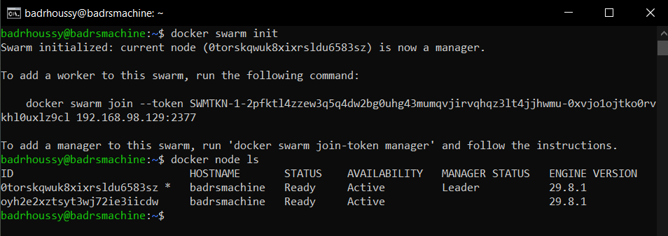

*Figure 1 — Initializing Swarm and checking cluster membership.*

### 2. Join a worker

On the worker, using the token generated by the manager:

```bash
docker swarm join --token <WORKER_JOIN_TOKEN> 192.168.98.129:2377
```

I used the token provided by the manager to connect the worker to the cluster.

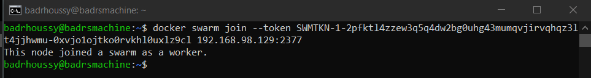

*Figure 2 — Worker registration using the manager address and join token.*

### 3. Create the web service

On the manager:

```bash
docker service create --name swarm1 web-bdcc
```

I deployed the `web-bdcc` application as a service called `swarm1`. Docker also displayed an image registry warning, which I would need to resolve for a more reliable deployment.

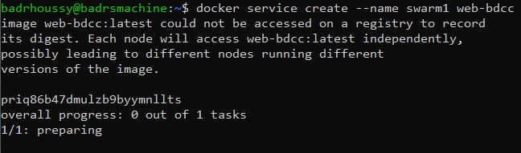

*Figure 3 — Creating the service with the web-bdcc image.*

### 4. Inspect the service and its task

```bash
docker service ls
docker service ps swarm1
```

Next, I checked the service status to make sure the application was running.

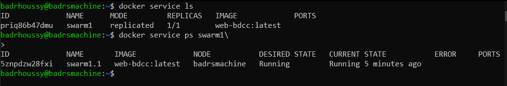

*Figure 4 — Verifying the service summary and its running task.*

### 5. Read the application logs

```bash
docker service logs swarm1
```

I looked at the logs to follow the application startup and check for any problems.

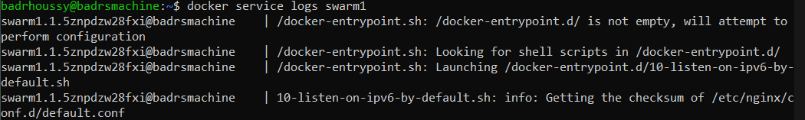

*Figure 5 — Inspecting service startup logs.*

### 6. Request five replicas

```bash
docker service update --replicas 5 swarm1
docker service ps swarm1
```

I then tried scaling the service to five replicas and checked its progress.

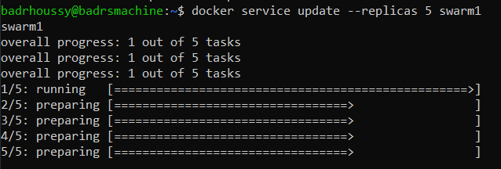

*Figure 6 — Requesting a larger replica count.*

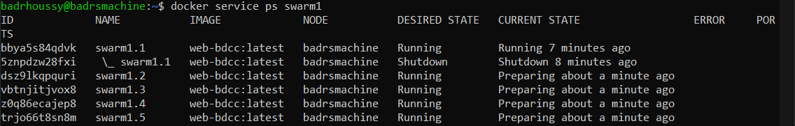

*Figure 7 — Inspecting tasks while the scale operation is still in progress.*

Scaling was still in progress when I took the screenshot.

### 7. Publish the service and test web access

```bash
docker service update --publish-add published=8080,target=80 swarm1
```

I published the application on port **8080**, forwarding requests to port **80** inside the container. I then opened this address in my browser:

```text
http://192.168.98.129:8080
```

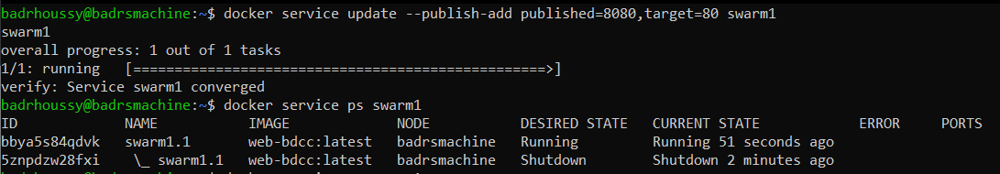

*Figure 8 — Adding the published port and inspecting the updated task.*

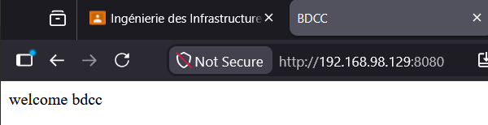

*Figure 9 — Successful browser access to the application.*

The page displayed **“welcome bdcc”**, so I could now access the application from the browser.

### 8. Remove the service

```bash
docker service rm swarm1
docker service ls
```

Before trying different deployment settings, I removed `swarm1`. I checked the service list afterwards, and it was empty.

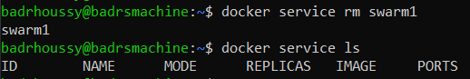

*Figure 10 — Removing the first deployment.*

### 9. Recreate the service with placement and memory settings

```bash
docker service create --name swarm1 \
  --constraint 'node.role == worker' \
  --limit-memory=1GB \
  web-bdcc

docker service ls
```

Finally, I recreated the service so it would run on a worker node, with a memory limit of **1 GB per task**.

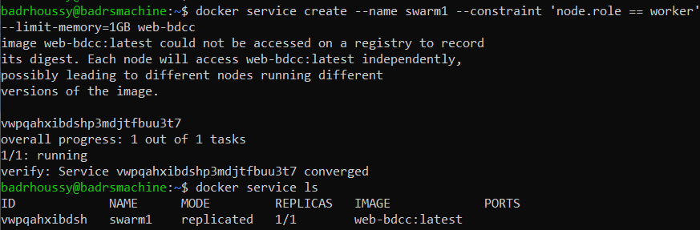

*Figure 11 — Successful creation with placement and resource settings.*

## What I learned

This lab helped me understand the difference between starting a container and managing an application as a service. The manager coordinates the cluster and assigns tasks, while workers run the tasks assigned to them. Joining the worker made that relationship much clearer to me.

I also became more comfortable checking a deployment. `docker node ls` tells me about the cluster, `docker service ls` gives me the service overview, and `docker service ps` shows the individual tasks. The logs help explain what is happening inside the application. Using these commands together was more useful than relying on a single success message.

I learned how to change the number of replicas and why it is important to check that they have started. Scaling takes time, so I need to verify the result after requesting a change.

Publishing port 8080 helped me connect the deployment commands to something I could test directly: the web page. The placement constraint and memory limit then showed me how to control where a service runs and how much memory each task can use. The image warning was another useful reminder that a deployment across multiple nodes depends on those nodes being able to access the application image.

## Results and conclusion

By the end of this part, I had set up a Swarm cluster, deployed the application, and opened it in a browser. I also practiced scaling and changing the deployment settings. I would still need to check that the scaling operation had finished.

Docker Swarm was a useful starting point because I could work through the main ideas with a small set of commands. It gave me a practical introduction to orchestration and made the relationship between nodes, services, and tasks easier to understand.

For a larger application with changing traffic and a need for more automation, I would choose **Kubernetes** as the better fit. Its [Horizontal Pod Autoscaler](https://kubernetes.io/docs/concepts/workloads/autoscaling/horizontal-pod-autoscale/) can adjust the number of replicas based on CPU, memory, or other metrics once the autoscaler and metrics collection are configured. Its [Services](https://kubernetes.io/docs/concepts/services-networking/service/) provide stable access to application replicas and support traffic distribution, with external load balancing depending on the infrastructure and configuration.

Swarm already provides load balancing, so that feature alone would not be my reason to switch. What makes Kubernetes more appealing for that larger setup is the combination of automatic scaling and more flexible networking options. It takes more effort to set up and maintain, but those capabilities would be useful as the application grows.
